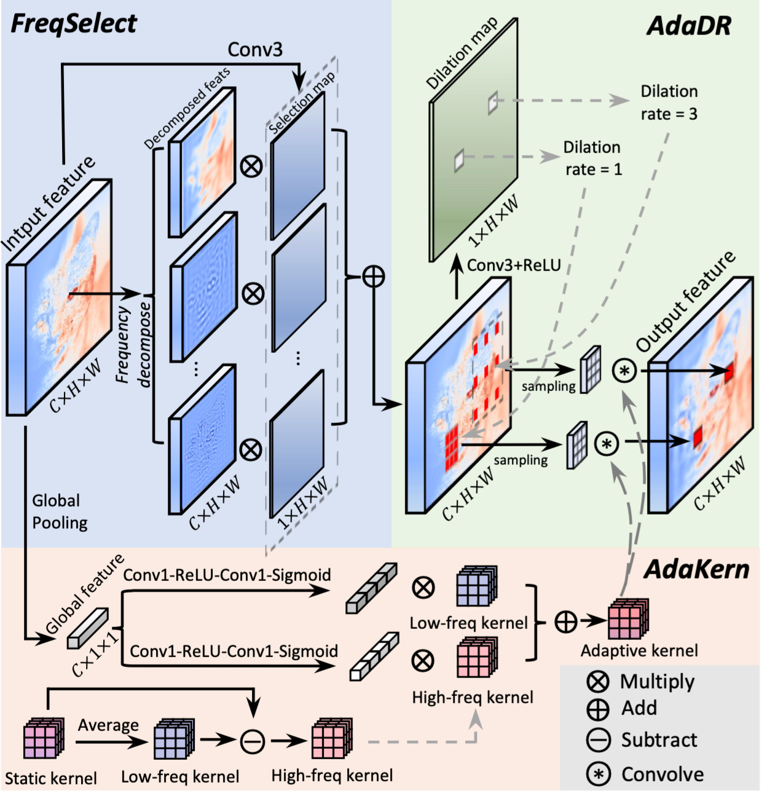

# CVPR 2024 Frequency-Adaptive Dilated Convolution

The implementation  of our CVPR 2024 paper "[Frequency-Adaptive Dilated Convolution](https://arxiv.org/abs/2403.05369)".

Interested readers are also referred to an insightful [Note]() about this work in Zhihu (TODO). 

**Abstract**

Dilated convolution, which expands the receptive field by inserting gaps between its consecutive elements, is widely employed in computer vision. In this study, we propose three strategies to improve individual phases of dilated convolution from the view of spectrum analysis. Departing from the conventional practice of fixing a global dilation rate as a hyperparameter, we introduce Frequency-Adaptive Dilated Convolution (FADC) which dynamically adjusts dilation rates spatially based on local frequency components. 
Subsequently, we design two plug-in modules to directly enhance effective bandwidth and receptive field size. The Adaptive Kernel (AdaKern) module decomposes convolution weights into low-frequency and high-frequency components, dynamically adjusting the ratio between these components on a per-channel basis. By increasing the high-frequency part of convolution weights, AdaKern captures more high-frequency components, thereby improving effective bandwidth. The Frequency Selection (FreqSelect) module optimally balances high- and low-frequency components in feature representations through spatially variant reweighting. It suppresses high frequencies in the background to encourage FADC to learn a larger dilation, thereby increasing the receptive field for an expanded scope. Extensive experiments on segmentation and object detection consistently validate the efficacy of our approach. 


## Highlight✨

- We conduct an in-depth exploration of dilated convolution using frequency analysis, reframing the assignment of dilation as a trade-off problem that involves balancing effective bandwidth and receptive field.
- We introduced Frequency-Adaptive Dilated Convolution (FADC). It adopts Adaptive Dilation Rate (AdaDR), Adaptive Kernel (AdaKern), and Frequency Selection (FreqSelect) strategies. AdaDR dynamically adjusts dilation rates in a spatially variant manner to achieve a balance between effective bandwidth and receptive field. AdaKern adaptive adjusts the kernel to fully utilize the bandwidth and FreqSelect learns a frequency-balanced feature to encourage a large receptive field.
- We validate our approach through comprehensive experiments in the segmentation task, consistently demonstrating its effectiveness. Furthermore, the proposed AdaKern and FreqSelect also prove to be effective when integrated with deformable convolution and dilated attention in object detection and segmentation tasks.




## Code Usage

### Installation

Our code is based on [MMSegmentation](https://github.com/open-mmlab/mmsegmentation).

Please refer to [get_started.md](https://github.com/open-mmlab/mmsegmentation/blob/main/docs/en/get_started.md#installation) for installation and [dataset_prepare.md](https://github.com/open-mmlab/mmsegmentation/blob/main/docs/en/user_guides/2_dataset_prepare.md#prepare-datasets) for dataset preparation.

You can install mmcv-full by: 

```
pip install torch==1.11.0+cu113 torchvision==0.12.0+cu113 -f https://download.pytorch.org/whl/torch_stable.html
pip install mmcv-full==1.5.3 -f https://download.openmmlab.com/mmcv/dist/cu113/torch1.11/index.html
```

### Results

| Method  | Backbone        | Crop Size | Lr Schd | mIoU |
| ------- | --------------- | --------- | ------- | ---- |
| UPerNet | R50             | 512x512   | 160k    | 40.7 |
| UPerNet | R50+FADC (Ours) | 512x512   | 160k    | 44.4 |

If you use our dataset or code for research, please cite this paper  (to be updated): 

```
@inproceedings{chen2024FADC,
  title={Frequency-Adaptive Dilated Convolution for Semantic Segmentation},
  author={Chen, Linwei and Gu, Lin and Fu, Ying},
  {Proceedings of the IEEE conference on computer vision and pattern recognition},
  year={2024}
}
```


## Contact

If you find any problem, please feel free to contact me (Linwei at  chenlinwei@bit.edu.cn). A brief self-introduction (including your name, affiliation, and position) is required, if you would like to get in-depth help from me. I'd be glad to talk with you if more information (e.g. your personal website link) is attached.