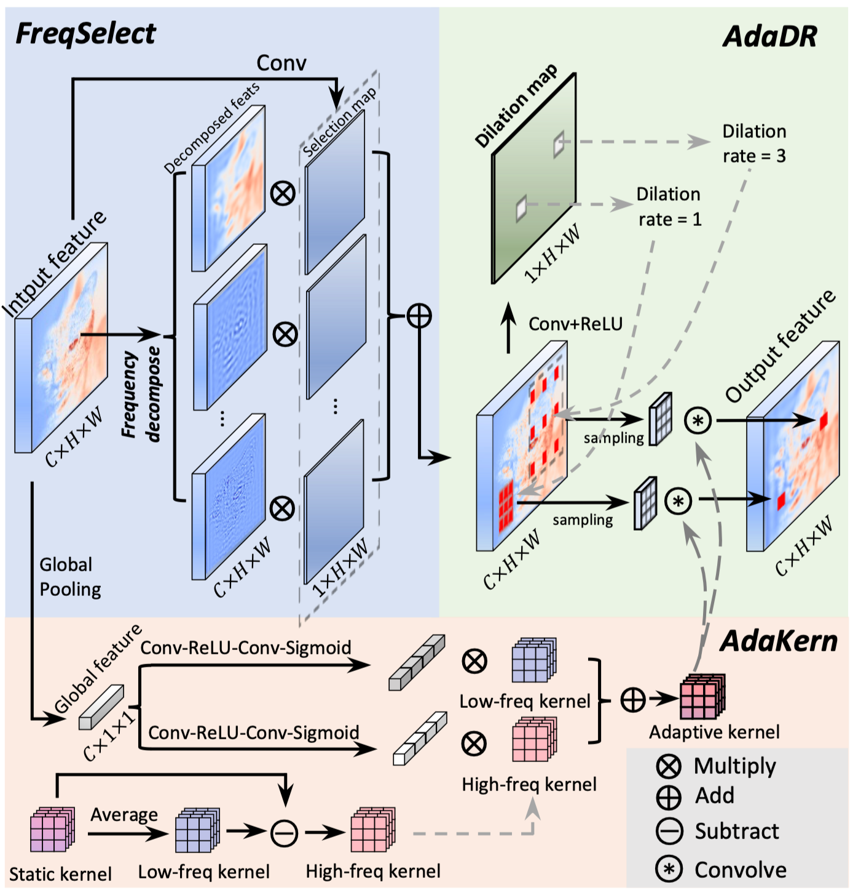

# CVPR 2024 Poster (Highlight): Frequency-Adaptive Dilated Convolution

The preliminary [official implementation](https://github.com/Linwei-Chen/FADC) of our CVPR 2024 paper "[Frequency-Adaptive Dilated Convolution](https://arxiv.org/abs/2403.05369)", which is also available at https://github.com/ying-fu/FADC.

Interested readers are also referred to an insightful [Note](https://zhuanlan.zhihu.com/p/705486302) about this work in Zhihu (TODO). 

**Abstract**

Dilated convolution, which expands the receptive field by inserting gaps between its consecutive elements, is widely employed in computer vision. In this study, we propose three strategies to improve individual phases of dilated convolution from the view of spectrum analysis. Departing from the conventional practice of fixing a global dilation rate as a hyperparameter, we introduce Frequency-Adaptive Dilated Convolution (FADC) which dynamically adjusts dilation rates spatially based on local frequency components. 
Subsequently, we design two plug-in modules to directly enhance effective bandwidth and receptive field size. The Adaptive Kernel (AdaKern) module decomposes convolution weights into low-frequency and high-frequency components, dynamically adjusting the ratio between these components on a per-channel basis. By increasing the high-frequency part of convolution weights, AdaKern captures more high-frequency components, thereby improving effective bandwidth. The Frequency Selection (FreqSelect) module optimally balances high- and low-frequency components in feature representations through spatially variant reweighting. It suppresses high frequencies in the background to encourage FADC to learn a larger dilation, thereby increasing the receptive field for an expanded scope. Extensive experiments on segmentation and object detection consistently validate the efficacy of our approach. 


## Highlight✨

- We conduct an in-depth exploration of dilated convolution using frequency analysis, reframing the assignment of dilation as a trade-off problem that involves balancing effective bandwidth and receptive field.
- We introduced Frequency-Adaptive Dilated Convolution (FADC). It adopts Adaptive Dilation Rate (AdaDR), Adaptive Kernel (AdaKern), and Frequency Selection (FreqSelect) strategies. AdaDR dynamically adjusts dilation rates in a spatially variant manner to achieve a balance between effective bandwidth and receptive field. AdaKern adaptive adjusts the kernel to fully utilize the bandwidth and FreqSelect learns a frequency-balanced feature to encourage a large receptive field.
- We validate our approach through comprehensive experiments in the segmentation task, consistently demonstrating its effectiveness. Furthermore, the proposed AdaKern and FreqSelect also prove to be effective when integrated with deformable convolution and dilated attention in object detection and segmentation tasks.



## Code Usage

The clean code for **FADC** is available [here](https://github.com/Linwei-Chen/FADC/blob/main/FADC_only/conv_custom.py). The usage is very simple, it is basically the same as the standard convolution layer.

```python
x = torch.rand(2, 4, 16, 16).cuda()
m = AdaptiveDilatedConv(in_channels=4, out_channels=8, kernel_size=3).cuda()
y = m(x)
```

The **FADC** relies on mmcv libarary, you can install mmcv-full by: 

```
pip install torch==1.11.0+cu113 torchvision==0.12.0+cu113 -f https://download.pytorch.org/whl/torch_stable.html
pip install mmcv-full==1.5.3 -f https://download.openmmlab.com/mmcv/dist/cu113/torch1.11/index.html
```

You can refer to https://mmcv.readthedocs.io/en/v1.7.0/get_started/installation.html and select the appropriate installation command depending on the type of system, CUDA version, PyTorch version, and MMCV version.

### Installation

Our code is based on [MMSegmentation](https://github.com/open-mmlab/mmsegmentation). You can install mmseg by:

```
pip install mmsegmentation==0.25.0
```

Please refer to [get_started.md](https://github.com/open-mmlab/mmsegmentation/blob/main/docs/en/get_started.md#installation) for more details on installation, and [dataset_prepare.md](https://github.com/open-mmlab/mmsegmentation/blob/main/docs/en/user_guides/2_dataset_prepare.md#prepare-datasets) for information on dataset preparation. For further details on code usage, you can refer to [this](https://github.com/raoyongming/HorNet/tree/master/semantic_segmentation).

You can install mmcv-full by: 

```
pip install torch==1.11.0+cu113 torchvision==0.12.0+cu113 -f https://download.pytorch.org/whl/torch_stable.html
pip install mmcv-full==1.5.3 -f https://download.openmmlab.com/mmcv/dist/cu113/torch1.11/index.html
```

### Results

| Method                                                       | Backbone        | Crop Size | Lr Schd | mIoU |
| ------------------------------------------------------------ | --------------- | --------- | ------- | ---- |
| UPerNet                                                      | R50             | 512x512   | 160k    | 40.7 |
| UPerNet ([ckpt](https://pan.baidu.com/s/1uGNefkH1IpYvMZ6cmq5tXw?pwd=CVPR), code: CVPR) | R50+FADC (Ours) | 512x512   | 160k    | 44.4 |

Note:

The config can be found at [here](./configs/FADC).


<picture>
  <source
    media="(prefers-color-scheme: dark)"
    srcset="
      https://api.star-history.com/svg?repos=Linwei-Chen/FADC&type=Date&theme=dark
    "
  />
  <source
    media="(prefers-color-scheme: light)"
    srcset="
      https://api.star-history.com/svg?repos=Linwei-Chen/FADC&type=Date
    "
  />
  
</picture>


If you use our dataset or code for research, please cite this paper: 

```
@inproceedings{chen2024frequency,
  title={Frequency-Adaptive Dilated Convolution for Semantic Segmentation},
  author={Chen, Linwei and Gu, Lin and Zheng, Dezhi and Fu, Ying},
  booktitle={Proceedings of the IEEE/CVF Conference on Computer Vision and Pattern Recognition},
  pages={3414--3425},
  year={2024}
}
```

## Acknowledgment

This code is built using [mmsegmentation](https://github.com/open-mmlab/mmsegmentation), [timm](https://github.com/rwightman/pytorch-image-models) libraries, [HorNet](https://github.com/raoyongming/HorNet/tree/master/semantic_segmentation#readme) and [ConvNeXt](https://github.com/facebookresearch/ConvNeXt).

## Contact

If you encounter any problems or bugs, please don't hesitate to contact me at [chenlinwei@bit.edu.cn](mailto:chenlinwei@bit.edu.cn). To ensure effective assistance, please provide a brief self-introduction, including your name, affiliation, and position. If you would like more in-depth help, feel free to provide additional information such as your personal website link. I would be happy to discuss with you and offer support.